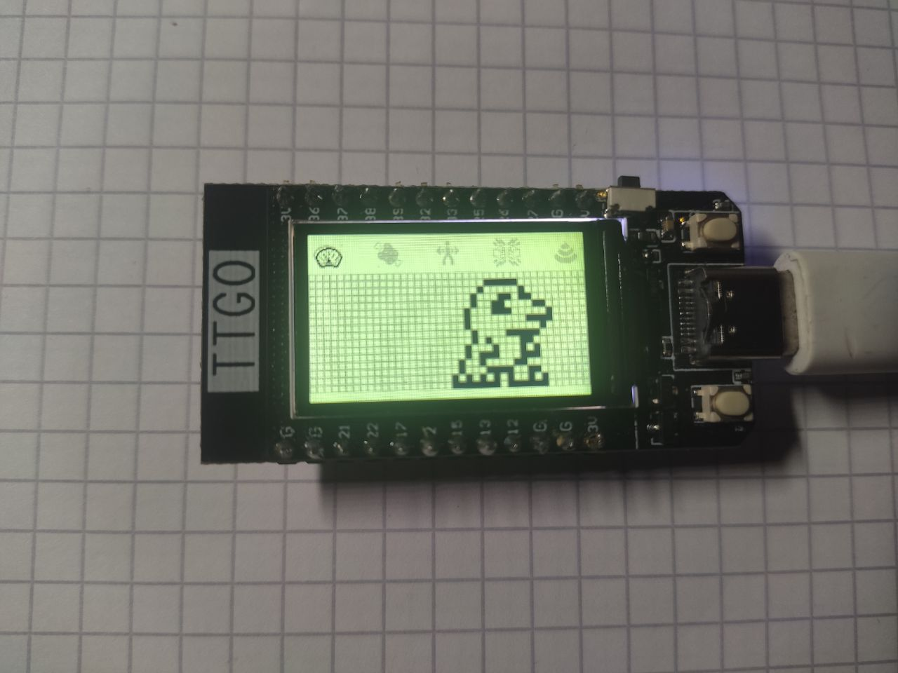

# HandPet（Ubuntu / RK3528A）

这是一个在 Ubuntu（含 RK3528A SoC）上运行的数码宠物项目。

目前状态：
- 支持在 Ubuntu 上运行（桌面 X11/Wayland 或 KMS/DRM），通过 `SDL2` 渲染，新增 `linux_main.cpp` 作为入口。
- 宠物动画支持 SVG 帧：优先从 `assets/digimon/<digimonIndex>/<spriteIndex>.svg` 渲染；若找不到对应 SVG，则回退到内置点阵帧，不会崩溃。
- 仅保留 Linux（Ubuntu/RK3528A）运行时所需代码；已移除 ESP32/Arduino 相关实现与说明。
- 菜单与各屏幕（名字/年龄体重/爱心/进度条/选择/时钟/看板娘/进食动画等）可正常运行。

截图：


### 资源与动画
- 每个宠物一个文件夹：`assets/digimon/<digimonIndex>/`
  - 必须：`0.svg`（默认立绘帧，用于选择页缩略显示）
  - 可选：其他动画帧 `1.svg`、`2.svg`、…（参考 `SPRITE_DIGIMON_*` 常量）
  - 示例：`assets/digimon/2/0.svg`、`assets/digimon/2/5.svg`
  - 常量参考：`src/VPetLCD/ImageData/DigimonSprites.h`（如 `SPRITE_DIGIMON_EATING1/2`）
- 字母/数字/菜单图标：当前使用内置点阵，后续可切换为 SVG（不影响功能）。

### Ubuntu/RK3528A 构建与运行
依赖：`cmake`、`libsdl2-dev`、`libcairo2-dev`、`librsvg2-dev`

```bash
sudo apt update
sudo apt install -y build-essential cmake libsdl2-dev libcairo2-dev librsvg2-dev
cmake -S . -B build
cmake --build build -j
./build/vpet
# 若无桌面环境，可尝试 KMS/DRM：
SDL_VIDEODRIVER=KMSDRM ./build/vpet
```

键位：
- 右方向键：下一项
- Enter/Space：确认
- 左方向键/Backspace：返回
- ESC：退出

### 新增功能（Ubuntu 24.04.3 适配）
- 宠物选择主界面：按左右切换宠物，回车确认。
- 训练系统：三档强度，左右调整，回车执行；提升 DP/努力值并消耗 HP。
- 健康系统：显示 HP（0-100），每 30 秒按状态自动恢复/流失；饥饿每 5 分钟下降 1，饥饿为 0 时逐步掉 HP 并累积生病风险。
- 清洁：在看板页通过菜单触发冲洗便便。

### 目标与规划（长期）
- 硬件独立：易于更换显示屏与输入设备。
- 功能：
  - Wi-Fi 连接
  - [A-/D-Com](https://www.alphahub.site/guide) 兼容
  - 通过互联网与原版 V-Pet 进行对战/合体（网关功能）
  - 兼容原版 V-Pet（ESP-VPET vs 原版）
  - 蓝牙直连对战/合体
- 可定制性：便于添加新宠物/进化线、修改规则和 UI。
